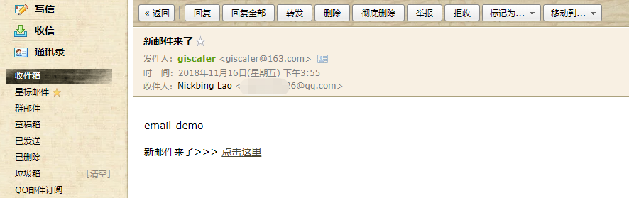

# email-demo

#### 项目介绍
邮件发送demo，含pdf附件发送。


#### 运行

1. npm install
2. 修改配置（见使用说明）
3. npm run start

#### 使用说明

修改`./config.js` 下相关信息，修改 `reveiveEmail` , `user` 和 `pass`

```js
module.exports = {
  reveiveEmail: '11111@qq.com', // 邮件通知对象，签到信息
  /* mail.js邮件发送者账号信息，此邮件发送到reveiveEmail */
  mail_opts: {
    host: 'smtp.163.com',
    port: 25,
    auth: {
      user: 'giscafer@163.com', // 邮箱账号 （改为你的，如果不是163，需要改host和post，不理解邮件协议请申请163邮箱测试）
      pass: '*****' // 密码（改为你的）
    }
  }
}


```





 